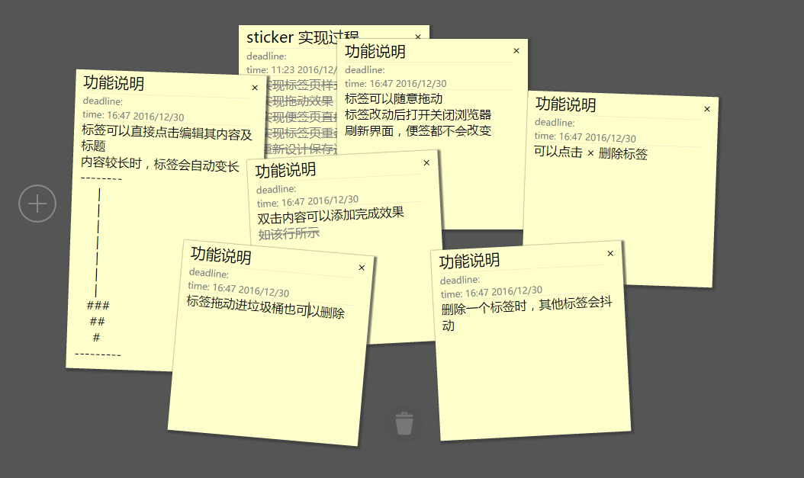

# 这是一个 html 的便签应用
---
## 效果展示

## 功能说明
- 便签可以直接编辑修改标题和内容
- 便签内容增加时，便签自动变长
- 便签可以任意拖动摆放
- 内容和位置将被自动保存，不随刷新浏览器、打开关闭页面等操作变化
- 将便签拖动至垃圾桶也可以删除内容
- 删除便签时有抖动特效
- 双击某行内容或者标题，可以添加完成效果

---
## 更新记录
- 2016/12/29
	- 创建了基本的便签和界面
	- 使便签可以移动
	- 使便签可以编辑
- 2016/12/30
	- 增加添加便签的功能
	- 实现 localstorage 存储
	- 重写绑定事件，使用事件委托实现
	- 增加删除便签的功能
	- 增加 trashBin 功能
	- 增加 删除时其他便签抖动功能
	- 增加 双击完成样式
- 2017/1/4
	- 增加了列表视图，按菜单键可以切换
	- 完成了列表视图的基本样式
	- TODO 详情使用了聊天气泡样式
	- TODO 的列表修改了滚动条样式

- 2017/1/7
	- 增加了列表页切换的动画
	- 完成了列表页内容的填入

- 2017/1/8
	- 页面切换时刷新界面的功能
	- 详情气泡三角随标签滚动而移动
---
## 待完成功能记录
- [x] 完成便签事项列表
- [x] 完成页面便签页和事项页的切换
- [ ] 在列表页实现编辑
- [ ] 实现便签页 deadline 格式化输入 
- [ ] 实现便签页 deadline 提醒
- [ ] 实现便签页按照 deadline 排序
- [ ] 实现用户登陆界面, 便于存储不同的 TODO 
- [ ] 重构 api, 用ajax实现与后端的交互
- [ ] 使用 node 实现后端的 TODO 存储
- [ ] 部署上线

	